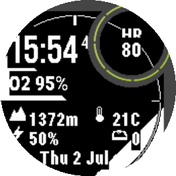

# UtilityFace — Instinct 2 Sensor Dashboard Watch Face

[](https://github.com/kv244/UtilityFace/releases/latest)

> Curious how a compiled `.PRG` is put together? See
> [REVERSE_ENGINEERING_A_PRG.md](REVERSE_ENGINEERING_A_PRG.md) for a
> walkthrough of the Connect IQ binary format and a decompile of this
> project's own build.

Quadrant-layout watch face for Garmin Instinct 2 (Surf Edition included,
same hardware). Displays time, HR, SpO2, altitude, ambient temp,
battery, daily step count, dynamic compass ring with a prominent North orientation tick, and date in
fixed screen positions — no menu diving. Features an optimized, dithered stone-texture
background image that preserves high contrast and text readability on 1-bit monochrome MIP screens.



## Layout (176×176, top-right subscreen)

```
        |  (N tick)  |
O2 95%       12:52       [ HR 67 ]
             :ss
        |           |
    ALT 1372m     T 21C
    BAT 50%    STEP 8214
         Wed 1 Jul
        |  (S tick)  |
```

## Hardware — Instinct 2 (Surf Edition)

| | |
|---|---|
| **CPU** | ARM Cortex-M4F @ ~200 MHz (exact clock not published by Garmin) |
| **Flash** | 32 MB (firmware + apps + data share this) |
| **RAM** | ~256 KB available to Connect IQ apps (heap-managed by the Monkey C runtime) |
| **Display** | 176×176 px, monochrome MIP (Memory-in-Pixel), always-on, sunlight-readable |
| **Sensors** | Barometric altimeter, 3-axis compass, wrist HR (Elevate v4), pulse-ox (SpO2), thermometer, accelerometer |
| **GPS** | Multi-band (L1/L5) with SatIQ; typical first fix ~30 s cold, <5 s warm |
| **Battery** | ~30 h GPS mode, ~28 days smartwatch mode (per Garmin spec) |

**Runtime memory budget for this face (estimated):**

The Connect IQ VM reserves a fixed heap per app. For watch faces on the
Instinct 2 family the limit is ~256 KB. Rough breakdown for UtilityFace:

- VM + runtime overhead: ~80 KB
- Compiled bytecode (`.prg`): ~12 KB
- String/font data loaded at runtime: ~20 KB
- Stack + local variables per `onUpdate` call: <1 KB
- **Total estimated peak: ~115 KB** — comfortably inside the 256 KB limit,
  leaving headroom for adding steps, stress, or body battery fields.

`System.getSystemStats().usedMemory` / `.totalMemory` report live figures at
runtime; call these in `onUpdate` and `dc.drawText` them temporarily to
profile your own builds.

## Toolchain

Garmin Connect IQ apps compile from **Monkey C** only. The SDK ships:

- `monkeyc` — compiler (CLI, scriptable — fits a PowerShell/CI pipeline)
- `simulator.exe` — runs the compiled `.prg` without a physical watch
- `monkeydo` — sideloads a build into the running simulator from CLI

Requires **Java 11+** on PATH. If not installed system-wide, prepend the JDK
bin dir before calling the SDK bat files (e.g. the JDK bundled with Processing
at `C:\Program Files\Processing\app\resources\jdk\bin` works fine).

## Setup

1. Install the Connect IQ SDK Manager from Garmin's developer site; pull the
   SDK and at least the `instinct2` device image through it.
2. Generate a developer signing key (required for every build, including
   local simulator runs):
   ```powershell
   openssl genrsa -out developer_key.pem 4096
   openssl pkcs8 -topk8 -inform PEM -outform DER `
       -in developer_key.pem -out developer_key.der -nocrypt
   ```
   Store `developer_key.der` somewhere permanent — losing it means you cannot
   update a previously published app.
3. VS Code + the **Monkey C** extension adds syntax highlighting and export
   tasks. `Run Current Application` requires the extension to manage the
   simulator launch itself; use the CLI workflow below if that option is absent.

## Build (CLI)

```powershell
$env:PATH = "C:\Program Files\Processing\app\resources\jdk\bin;$env:PATH"
$sdk = "C:\Users\julia\AppData\Roaming\Garmin\ConnectIQ\Sdks\connectiq-sdk-win-9.2.0-2026-06-09-92a1605b2\bin"

& "$sdk\monkeyc.bat" -l 3 -w -r -f monkey.jungle -d instinct2 `
    -o A1B2C3D4.PRG `
    -y "C:\Users\julia\AppData\Roaming\Garmin\ConnectIQ\developer_key.der"
```

Flags: `-l 3` = strict type check, `-w` = show warnings, `-r` = release
build (strips the Symbols section and embedded source paths — see
[REVERSE_ENGINEERING_A_PRG.md](REVERSE_ENGINEERING_A_PRG.md) for what that
means concretely). The `A1B2C3D4.PRG` that ends up in the project
directory is always this release build, same as CI's and WaveDetector's —
drop `-r` locally if you need a debug build with a full symbol table for
troubleshooting.

**Output filename**: Garmin names installed `.PRG` files on-device by an
8-hex-digit app ID (e.g. `E6672407.PRG`). UtilityFace has no CIQ Store ID yet
(unpublished), so the build uses `A1B2C3D4` — the first 8 hex characters of
the manifest's `application id` UUID (`manifest.xml`) — as a stable stand-in
that matches the same naming shape. See
[REVERSE_ENGINEERING_A_PRG.md](REVERSE_ENGINEERING_A_PRG.md) for how that
convention was identified.

## Run in simulator (CLI)

```powershell
Start-Process "$sdk\simulator.exe"
Start-Sleep -Seconds 5
& "$sdk\monkeydo.bat" A1B2C3D4.PRG instinct2
```

## Deploy to hardware

Copy `A1B2C3D4.PRG` to `GARMIN\Apps\` on the watch when connected via USB
(mass storage mode), or push via Garmin Express / Connect Mobile if signed for
distribution.

## Releases (CI)

[`.github/workflows/release.yml`](.github/workflows/release.yml) rebuilds
`A1B2C3D4.PRG` with the real Connect IQ SDK on every push to `main` that
touches source/resources/manifest/jungle, and — only if the build succeeds —
publishes it as a GitHub Release asset (tag `vYYYY.MM.DD-<sha>`). It uses
[connect-iq-sdk-manager-cli](https://github.com/lindell/connect-iq-sdk-manager-cli)
to fetch the SDK headlessly, which requires two repo secrets to be set under
*Settings → Secrets and variables → Actions* before it will run successfully:

| Secret | Value |
|---|---|
| `GARMIN_USERNAME` / `GARMIN_PASSWORD` | Credentials for a Garmin account with SDK access — used only to download the SDK, same login the SDK Manager GUI asks for |
| `CIQ_DEVELOPER_KEY_B64` | Your `developer_key.der` (see Setup below), base64-encoded: `[System.Convert]::ToBase64String([IO.File]::ReadAllBytes("developer_key.der"))` in PowerShell, or `base64 -w0 developer_key.der` on Linux/macOS |

The workflow accepts Garmin's CONNECT IQ SDK License Agreement /
Application Developer Agreement non-interactively on your behalf (the same
one accepted once via the SDK Manager GUI locally) so the SDK can be
downloaded in CI without a prompt.

## Permissions

- `SensorHistory` — HR, SpO2, elevation, temperature (last logged sample)
- `Sensor` + `Background` — live compass heading, refreshed every few
  minutes via `HeadingServiceDelegate`/`Background.registerForTemporalEvent`
  (Garmin throttles the interval; this is not a continuous stream). Falls
  back to `Activity.getActivityInfo().currentHeading` when no background
  sample has landed yet.

## WaveDetector (companion app)

[`WaveDetector/`](WaveDetector) is a separate Connect IQ *app* (not a
watch face) that prototypes accelerometer-based motion/wave detection via
`Sensor.registerSensorDataListener` — a continuous high-rate listener watch
faces can't hold onto. It's a threshold-crossing heuristic over a smoothed
acceleration-magnitude signal, not a validated surf algorithm; see that
project's source comments for the details and caveats.

Its own manifest app UUID is `b2c3d4e5-...`, so following the same
convention as `A1B2C3D4.PRG` above, its build output is named
`B2C3D4E5.PRG`. Unlike UtilityFace it has no CI/release pipeline yet
(see MEMORY.md), so its only build is a release (`-r`, stripped) one —
no separate dev build with debug symbols:

```powershell
& "$sdk\monkeyc.bat" -l 3 -w -r -f WaveDetector\monkey.jungle -d instinct2 `
    -o WaveDetector\B2C3D4E5.PRG `
    -y "C:\Users\julia\AppData\Roaming\Garmin\ConnectIQ\developer_key.der"
```

## Known gaps / next steps

- **GPS quality**: Removed (`Position.enableLocationEvents` is unavailable to
  watch face app types). Re-adding requires the `Positioning` permission and
  routing through a background service.
